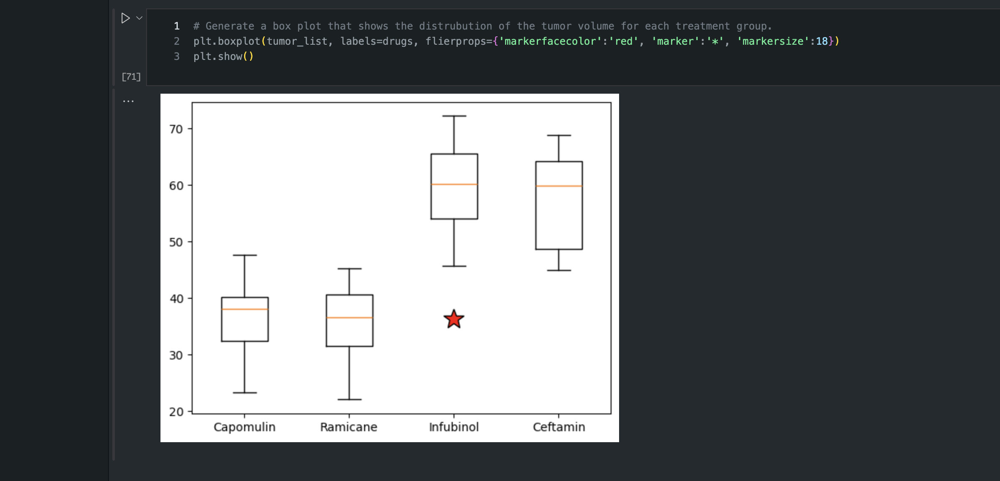

# Pymaceuticals

## Description
Conducted a study where 249 mice who were identified with SCC tumors received treatment with a range of drug regimens. Over the course of 45 days, tumor development was observed and measured. The purpose of this study was to compare the performance of Pymaceuticals’ drug of interest, Capomulin, against the other treatment regimens.

## Table of Contents
- [Installation](#installation)

- [Credits](#credits)
- [License](#license)

- [Contact](#contact)

## Installation
Matplotlib, Pandas, Python, Jupyter Notebook

## Credits
Catherine Matthews

## License
MIT

## Contact
If there are any questions of concerns, I can be reached at:
##### [github: mattcat1221](https://github.com/mattcat1221)
##### [email: caseyvmatthews@gmail.com](mailto:caseyvmatthews@gmail.com)
